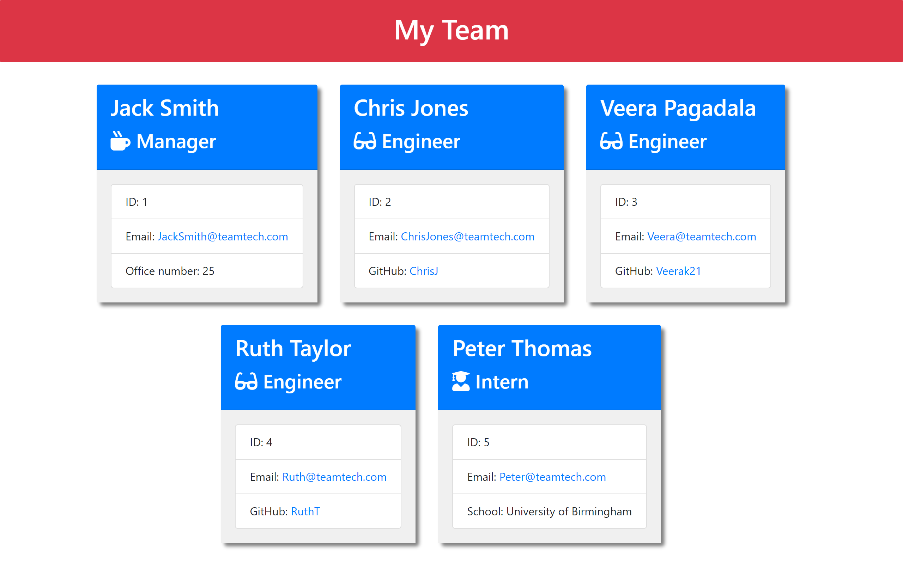

# Project Title: Team-Profile-Generator

## Description: 
 This is a command-line application. Here, information about employees' roles in a software engineering team is input to generate an HTML webpage displaying person-specific summaries. It provides a quick access to the employee email ids and GitHub profiles.
 
  ## Table of Contents:
  
  * [Installation](#installation)
  * [Usage](#usage)
  * [License](#license)
  * [Tests](#tests)
  * [Questions?](#questions)

## Installation:
  This application runs through Node.js. It needs the Inquirer package (version 8.2.4) for collecting the user input and Jest framework for running the unit tests. 

## Usage:
   The application can be invoked using a `node index.js` command. The user will be prompted to answer some questions. User should address all the prompts. The HTML webpage will be generated following the user input.
   
   Follow the [Walkthrough video]() for its potential applications. 

   The following screenshot depicts the generated website. 

   

## License:

 

Read more about the MIT licence here: https://opensource.org/licenses/MIT.

## Tests:
 The application classes can be tested using either the `npm run test` or `npm test`.

## Questions?
  ### Reach me here: 
   My GitHub profile:   [veerak21](https://github.com/veerak21),

   My E-mail: pv.kallu@gmail.com.